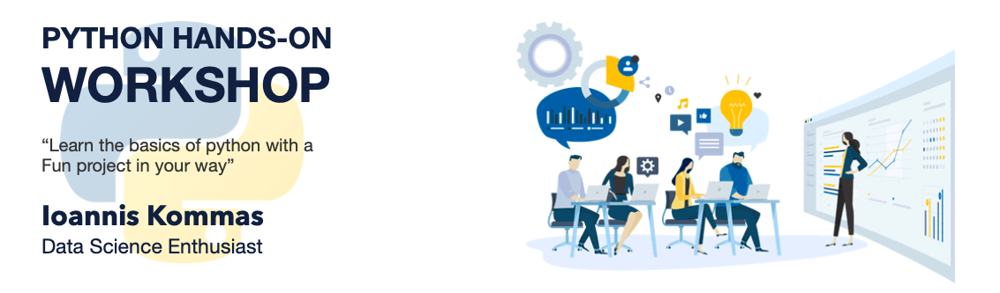

# Σκοπός του σεμιναρίου
Οι συμμετέχοντες θα είναι σε θέση να αναλύουν, να επεξεργάζονται και να επικοινωνούν ιδέες και δεδομένα με την χρήση της 
πιο δημοφιλούς γλώσσας προγραμματισμού στον κόσμο.

# Σε ποιούς απευθύνεται το σεμινάριο.
Το σεμινάριο είναι για αρχάριους και απευθύνεται σε όλους όσους ενδιαφέρονται να μάθουν προγραμματισμό με την python.

# Σε ποιούς απευθύνεται η γλώσσα προγραμματισμού python.
Η γλώσσα προγραμματισμού  python απευθύνεται σε όσους επιθυμούν
να χρησιμοποιήσουν την γλώσσα ως εργαλείο για:
- Πραγματοποίηση έρευνας και επεξεργασία δεδομένων
    - Επιστήμη Δεδομένων (Data Science)
    - Στατιστική (Statistics)
    - Τεχνητή Νοημοσύνη (Artificial Intelligence)
        - Μηχανική Μάθηση (Machine Learning)
        - Νευρωνικά Δίκτυα (Neural Networks)
    - Οικονομία (Financial Data)
    - Μαθηματικά (Mathematics)
    - Φυσικές Επιστήμες (Natural Science)
        - Φυσική
        - Βιοεπιστήμες
        
- Γενικά σε κάθε χώρο όπου απαιτείται η επεξεργασία δεδομένων μεγάλου όγκου για την πραγματοποίηση υπολογισμών.

# Υλικό Σεμιναρίου
- Θα βρείτε 3 Φακέλους
    - `LESSON`  Ασκήσεις προς επίλυση όπως διατυπώνονται στην παρουσίαση
    - `PROJECT` Ασκήσεις που απαιτούν περισσότερα βήματα για την επίλυση τους, θα βρείτε τουλάχιστον ένα project ανά κεφάλαιο.
    - `QUIZ` Περιέχει διάφορά quiz

# Eνότητες Σεμιναρίου
<table>
  <tbody>
    <tr align="center" valign="bottom">
      <td>
        <b>LESSON</b>
        
      </td>
      <td>
        <b>PROJECT</b>
        
      </td>
      <td>
        <b>QUIZ</b>
        
      </td>
    </tr>
    </tr>
    <tr valign="top">
      <td>
      <ul><li><b>01. Syntax</b></li>
        <ul>
          <li>01. Welcome</li>
          <li>02. Comments</li>
          <li>03. Print</li>
          <li>04. Strings</li>
          <li>05. Variables</li>
          <li>06. Errors</li>
          <li>07. Numbers</li>
          <li>08. Calculations</li>
          <li>09. Changing Numbers</li>
          <li>10. Exponents</li>
          <li>11. Modulo</li>
          <li>12. Concatenation</li>
          <li>13. Plus Equals</li>
          <li>14. Multi Line Strings</li>
          <li>15. Review</li>
        </ul>
        </ul>
      <ul>
        <li><b>02. Functions</b></li>
          <ul>
           <li>01. Introduction to Functions</li>
           <li>02. What is a Function</li>
           <li>03. Write a Function</li>
           <li>04. Whitespace</li>
           <li>05. Parameters</li>
           <li>06. Multiple Parameters</li>
           <li>07. Keyword Arguments</li>
           <li>08. Returns</li>
           <li>09. Multiple Return Values</li>
           <li>10. Scope</li>
           <li>11. Review</li>
           </ul>
      </ul>
        <ul>
        <li><b>03. Control Flow</b></li>
         <ul>
           <li>More...</li>
           </ul>
        </ul>
        <ul>
        <li><b>04. Lists</b></li>
         <ul>
           <li>More...</li>
           </ul>
        </ul>
        <ul>
        <li><b>05. Loops</b></li>
         <ul>
           <li>More...</li>
           </ul>
        </ul>
        <ul>
        <li><b>06. Strings</b></li>
         <ul>
           <li>More...</li>
           </ul>
        </ul>
        <ul>
        <li><b>07. Modules</b></li>
         <ul>
           <li>More...</li>
           </ul>
        </ul>
        <ul>
        <li><b>08. Dictionaries</b></li>
         <ul>
           <li>More...</li>
           </ul>
        </ul>
        <ul>
        <li><b>09. Files</b></li>
         <ul>
           <li>More...</li>
           </ul>
        </ul>
        <ul>
        <li><b>10. Classes</b></li>
         <ul>
           <li>More...</li>
           </ul>
        </ul>
        <ul>
        <li><b>11. Function Arguments</b></li>
         <ul>
           <li>More...</li>
           </ul>
        </ul>
      </td>
      <td>
      <ul><li><b>01. Syntax</b></li>
        <ul>
          <li>Sales</li>
          <li>Medical Insurance</li>
        </ul>
        </ul>
      <ul>
        <li><b>02. Functions</b></li>
          <ul>
           <li>Getting Ready for Physics</li>
           <li>Medical Insurance</li>
           </ul>
      </ul>
        <ul>
        <li><b>03. Control Flow</b></li>
         <ul>
           <li>Games of Chance</li>
           </ul>
        </ul>
      </td>
      <td>
      <ul><li><b>01. Syntax</b></li>
        <ul>
          <li>More...</li>
        </ul>
        </ul>
      <ul>
        <li><b>02. Functions</b></li>
          <ul>
           <li>More...</li>
           </ul>
      </ul>
        <ul>
        <li><b>03. Control Flow</b></li>
         <ul>
           <li>More...</li>
           </ul>
        </ul>
      </td>
    </tr>  
  </tbody>
</table>

# Προετοιμασία Παρακολούθησης Σεμιναρίου
- Οι μαθητές θα πρέπει να έχουν δικό τους laptop με προεγκατεστημένες εφαρμογές.
- Στον φάκελο `MATERIAL` θα βρείτε οδηγίες και υλικό που καλείστε να παρακολουθήσετε πριν ξεκινήσουν τα μαθήματα.
    - Διαβάστε προσεκτικά τις οδηγίες εδώ: <a href="MATERIAL/">Click me</a>

https://code-with-me.jetbrains.com/9DO8pq6k7kr1QOlAzzlG_g#p=PY&fp=D75C9064F8C8CFD40356E261F55973FB453E94EF3CB0EFB07BF6B453B5008B50

